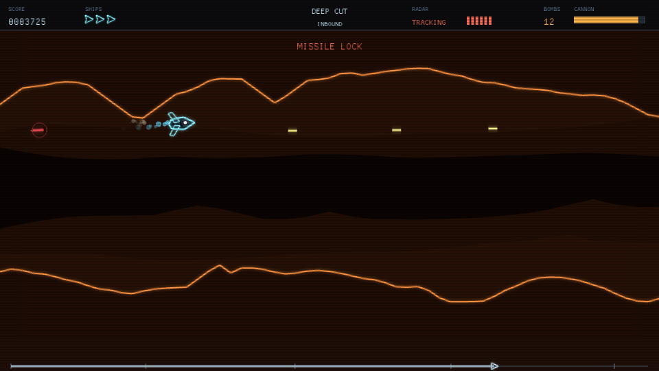
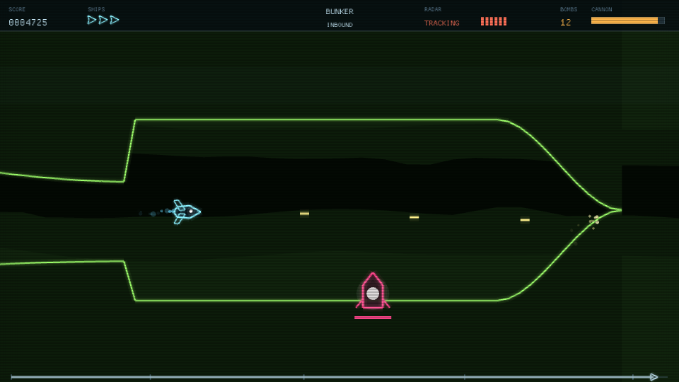
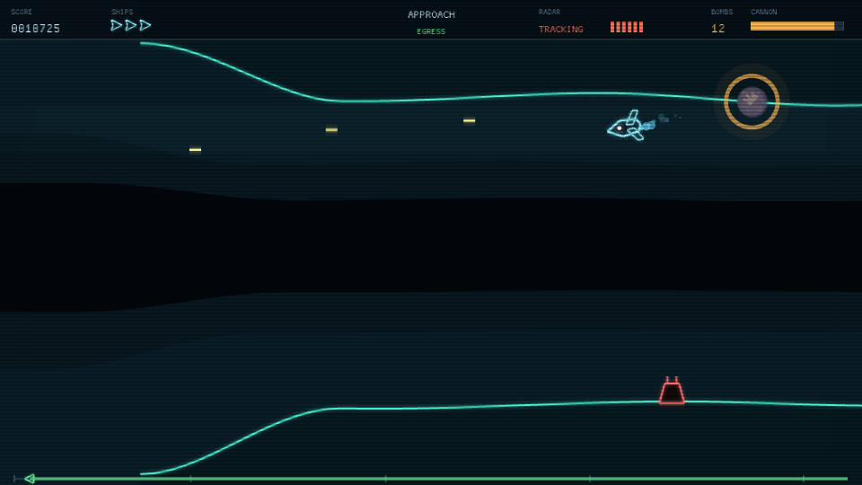
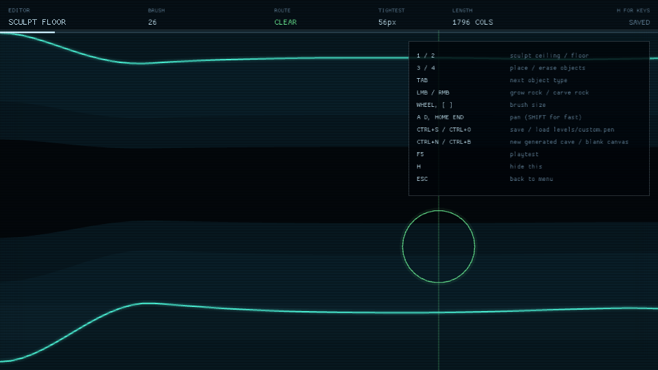
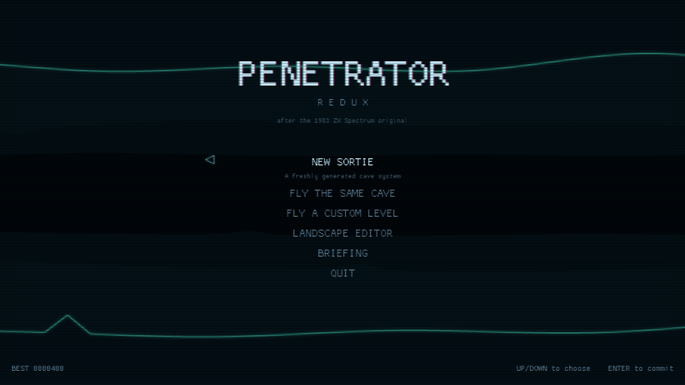

# Penetrator Redux

A modern redesign of **Penetrator** (Philip Mitchell / Beam Software, published by
Melbourne House, 1983) — the ZX Spectrum cave-flyer that a lot of people
remember mostly for shipping with a landscape editor.

Fly a strike aircraft through four zones of a defended cave system, bomb the
nuclear warhead at the back of the bunker, and fly out again. The way home is
faster, the defences have been rebuilt, and interceptors are up.

Written in Rust on [macroquad](https://macroquad.rs/). One dependency, no asset
files — the sound effects are synthesised at startup and the caves are generated
from a seed.

```
cargo run --release
```



---

## Screenshots

| | |
|---|---|
|  |  |
| *The warhead, sealed behind the bunker wall. Bombs only — cannon will not penetrate it.* | *The way home, under interceptor fire. Egress is faster and everything except the radar has been rebuilt.* |
|  |  |
| *The landscape editor. `ROUTE` and `TIGHTEST` continuously check that what you are sculpting can still be flown.* | *Four zones, one continuous track, generated from a seed.* |

---

## Contents

| Document | What it covers |
|---|---|
| [docs/GAMEPLAY.md](docs/GAMEPLAY.md) | The player's manual: controls, targets, scoring, tactics |
| [docs/ARCHITECTURE.md](docs/ARCHITECTURE.md) | How the code is put together and why |
| [docs/LEVEL-FORMAT.md](docs/LEVEL-FORMAT.md) | The `.pen` file format and the landscape editor |
| [docs/DESIGN-NOTES.md](docs/DESIGN-NOTES.md) | What changed from 1983, and what the playtesting found |

---

## Requirements

* Rust 1.75 or later.
* A GPU with OpenGL 3.3 / GLES 2 (anything from the last fifteen years), and a
  display. There is no headless mode: the window is created by macroquad before
  any of this crate's code runs, so on a machine with no `DISPLAY` the binary
  exits with `XOpenDisplay() failed!`. The test suite has no such requirement —
  the simulation runs perfectly well without a window, which is how
  `tests/mission.rs` flies whole missions.
* **Linux only:** ALSA. The runtime library is on virtually every desktop
  already; the *development* symlink usually is not, and without it the linker
  fails with `unable to find library -lasound`.

  `build.rs` handles that case: if the bare `libasound.so` name is missing but
  the versioned runtime library is present, it links against that directly and
  prints a one-line notice. So `cargo run` works out of the box, no root needed.

  To silence the notice, install the dev package:

  ```sh
  sudo apt install libasound2-dev      # Debian / Ubuntu
  sudo dnf install alsa-lib-devel      # Fedora
  ```

  Or skip sound altogether — this compiles the audio backend out entirely, and
  is how the tests and CI run:

  ```sh
  cargo run --release --no-default-features
  ```

macOS and Windows need nothing beyond the Rust toolchain.

## Building and running

```sh
cargo run --release            # play
cargo test                     # 159 tests, including a full flown mission
cargo doc --open               # module documentation
```

The release profile matters. Debug builds run, but the particle system is
noticeably chunky on older machines — `[profile.dev]` is set to `opt-level = 1`
to take the worst of that off during development.

## Controls

| Key | Action |
|---|---|
| `W` `S` or `↑` `↓` | Climb and dive |
| `A` `D` or `←` `→` | Throttle back and forward |
| `Space` or `Z` | Cannon — watch the heat bar |
| `Shift` `X` `B` | Drop bomb |
| `P` or `Esc` | Pause |
| `M` | Mute |
| `F1` | CRT filter on / off |
| `F3` | Debug overlay |
| `F11` | Fullscreen |

The throttle does not make you faster; it slides you forward and back within the
screen. Sitting further forward means seeing less of what is coming. That trade
is the whole flight model, and it is inherited straight from the original.

## The mission in one paragraph

Four zones out, each tighter and faster than the last. Radar dishes guide every
missile in the game: while one still stands, every SAM launched at you steers.
Kill them all and the missiles fly ballistic and become almost free. At the end
is a bunker, and at the back of the bunker is the warhead — armoured against
cannon fire, so you have to bomb it. Then the mission turns round and you fly
the whole thing backwards, faster, against defences that have been rebuilt.
Radar you destroyed stays destroyed. That is the reward for doing it properly on
the way in.

## What is in the box

* **Procedural caves.** Every run generates a new four-zone system from a seed.
  The generator guarantees two things: the cave is never narrower than the ship
  can fit through, and never steeper than the ship can climb at scroll speed.
  Both are proven by tests over hundreds of seeds.
* **A landscape editor**, because leaving it out of a Penetrator redesign would
  be missing the point. Sculpt the cave with a brush, place emplacements, save,
  and press `F5` to fly what you just built.
* **Synthesised audio.** Twelve effects and a looping engine drone, generated
  into WAV buffers at startup. No asset directory to lose.
* **A neon-vector look** with an optional CRT filter, drawn on a fixed 480×270
  virtual canvas that letterboxes onto any window without ever stretching.

## Project layout

```
build.rs         links ALSA without the dev package, when it has to
src/
  config.rs      every tunable number in the game, and nothing else
  rng.rs         deterministic seeded generator
  util.rs        numeric helpers
  input.rs       keyboard to abstract actions
  terrain.rs     the cave: heightmaps, generation, collision, sculpting
  level.rs       campaign definition, spawns, the .pen format
  world.rs       the simulation
  player.rs      flight model and weapons
  enemy.rs       enemy behaviour
  projectile.rs  everything in flight
  fx.rs          particles, shockwaves, screen shake
  render.rs      virtual canvas, neon primitives, CRT
  hud.rs         head-up display and overlays
  theme.rs       palettes
  editor.rs      the landscape editor
  audio.rs       synthesised sound
  save.rs        high scores, settings, level files
  app.rs         screens and the frame loop
tests/
  mission.rs     an autopilot that flies whole missions end to end
levels/
  example.pen    a hand-written level, as a worked example of the format
```

## Testing

159 tests, split three ways.

**Unit tests** live next to the code they cover and check the pieces: that the
RNG is reproducible, that a missile cannot turn faster than its stated rate,
that the `.pen` parser rejects a level file with a typo in it and says which
line.

**Invariant tests** check the promises the generator makes, across many seeds at
once — that no seed produces a cave too narrow to fly through, that no seed
produces a slope too steep to climb, that every seed puts at least one radar
dish in the world so the central mechanic exists.

**Mission tests** fly. `tests/mission.rs` contains an autopilot that reads the
same world the renderer does and produces the same input a keyboard would, and
flies complete missions from the cave mouth to the warhead and back out. It is
not a good pilot — it dies twenty to sixty times a run — but if a mission can
only be finished by a human playing well, it fails. That test found the two
worst bugs in this codebase: bombs drifting past a stationary target in the
bunker, and an escape condition the ship could never physically reach.

What it could *not* find was that the whole game rendered upside down — the
simulation was perfectly correct, and only the projection matrix was wrong.
That one needed a screenshot, and it is now covered by a test on the matrix
itself. See [docs/DESIGN-NOTES.md](docs/DESIGN-NOTES.md).

```sh
cargo test --release           # the mission tests are much faster optimised
cargo test --no-default-features   # no audio device needed
```

## Licence

MIT — see [LICENSE](LICENSE).

The original *Penetrator* is © 1983 Beam Software / Melbourne House; this is a
from-scratch homage that shares no code or assets with it. The name is used to
say what the game is descended from, nothing more.
