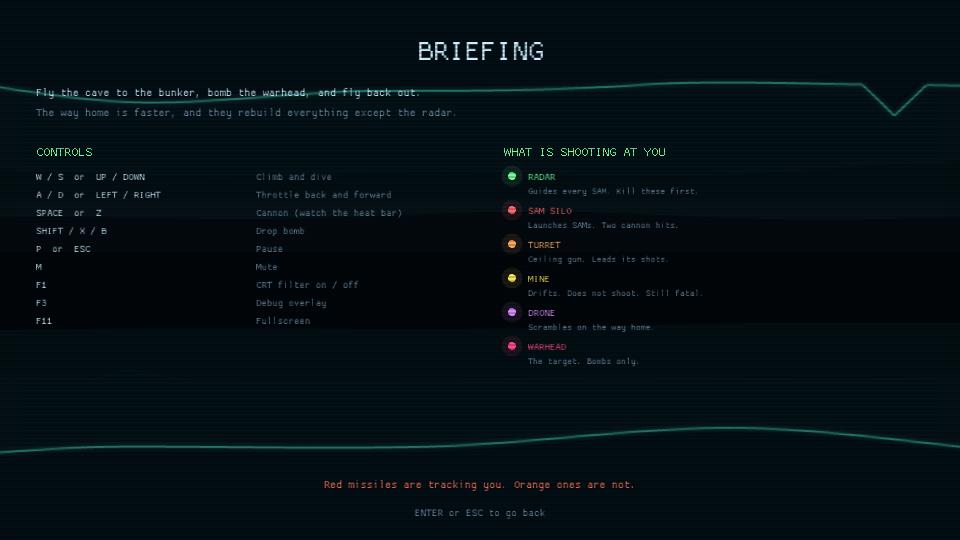

# Gameplay

The player's manual. Everything here is what the game actually does; the numbers
are the ones in `src/config.rs`.

---

## The mission

You fly a single aircraft into a cave system that has a nuclear warhead at the
bottom of it. The run has three parts.

### 1. Inbound — four zones

| # | Zone | Scroll speed | Tightest gap | What is new |
|---|---|---|---|---|
| 1 | **APPROACH** | 112 | 96 | Silos and the occasional dish. A tutorial you are not told is a tutorial. |
| 2 | **RAVINE** | 126 | 82 | Ceiling turrets, more mines, rougher walls. |
| 3 | **THE TEETH** | 138 | 70 | Short-wavelength terrain. Stalactites and stalagmites, close together. |
| 4 | **DEEP CUT** | 150 | 62 | The tightest and fastest cave in the game, and the densest defences. |

Speeds are world units per second on a 480-unit-wide screen; the ship is 18 long
and 8 tall. Each zone is its own **checkpoint** — crash in THE TEETH and you
restart THE TEETH, not the mission.

### 2. The bunker

At the end of DEEP CUT the corridor squeezes down to a 56-unit slot and opens
into a chamber. **The camera stops here.** Nothing is pushing you forward any
more; you stay in the chamber until the warhead is destroyed or you are.

The warhead is armoured. Cannon rounds spark off it and do nothing at all. You
have to put bombs on it — eight points of damage, four per direct hit, so two
good ones. A damage bar under it tells you how you are doing.

Behind the warhead the chamber is sealed. There is no way through; the only way
out is the way you came in.

### 3. Egress

The instant the warhead goes up, the mission turns round. You fly the entire
cave system backwards, and three things have changed:

* **It is faster.** Scroll speed is 1.18× the outbound figure.
* **The defences are back.** Every silo, turret and mine you destroyed has been
  rebuilt, and they fire 1.35× as often.
* **Interceptors are up.** Drones scramble in the open stretches of cave.

One thing has *not* changed: **radar dishes you destroyed stay destroyed.** That
is the reward for clearing them properly on the way in, and it is the difference
between a survivable run home and a very short one.

The mission ends when you fly out of the cave mouth.

---

## Controls

The same list is on the **BRIEFING** screen in the game, so you never have to
come back here for it:

| Key | Action |
|---|---|
| `W` `S` or `↑` `↓` | Climb and dive |
| `A` `D` or `←` `→` | Throttle back and forward |
| `Space` or `Z` | Cannon |
| `Shift` `X` `B` | Drop bomb |
| `P` or `Esc` | Pause |
| `R` (while paused) | Abandon the run |
| `M` | Mute |
| `F1` | CRT filter |
| `F3` | Debug overlay |
| `F11` | Fullscreen |

### What the throttle actually does

It does not change how fast you cross the cave — the camera does that at the
zone's speed regardless. What it changes is **where you sit on the screen**,
anywhere between 54 and 404 units from the trailing edge.

Sitting forward means less warning about what is coming. Sitting back means more
warning, but your cannon's 340-unit reach no longer covers the emplacements
before they can see you. That trade is the flight model.

Let go of the throttle and the ship drifts gently back toward its resting
position at 132. Slowly enough that you can hold a forward posture by feel.

On the way home the whole band mirrors. "Forward" still means further into the
unknown, whichever way the screen is scrolling.

---

## Weapons

### Cannon

Fires forward at 460 units per second, reaching 340 units. One point of damage.
About nine and a half rounds per second.

It has a **heat bar**, top right. Every round adds heat; heat bleeds off at 0.44
per second. Sustained fire overheats it in about 2.7 seconds, and once it locks
out it will not fire again until it has cooled back to 35% — roughly another
1.5 seconds, with an alarm and a red `OVERHEAT` bar to tell you.

This is not a magazine. It is a limiter on holding the trigger down forever, and
the way to beat it is to fire in bursts at things worth hitting.

**Cannon rounds shoot down missiles.** This is not a bonus, it is the answer to
the question the game keeps asking. A SAM in your face with nowhere to dodge to
is a SAM you shoot.

### Bombs

Twelve of them. They fall under gravity, keep the ship's own horizontal speed,
and detonate on the first thing they touch with a 26-unit blast. Four points of
damage, and the blast **also sweeps up incoming missiles**, so a well-timed drop
is a legitimate defensive move.

One bomb regenerates every 2.6 seconds up to the maximum. You cannot be
permanently disarmed, and you cannot carpet-bomb.

Bombs are the only thing that will hurt the warhead.

---

## What is shooting at you

| Target | Colour | HP | Behaviour | Score |
|---|---|---|---|---|
| **SAM silo** | red | 2 | Floor-mounted. Launches at anything approaching within 264 units, roughly one every 3.4 seconds. | 150 |
| **Radar dish** | green | 2 | Does not shoot. While *any* dish is standing, every missile launched steers. | 400 |
| **Turret** | orange | 2 | Ceiling-mounted. Fires an aimed, led shell every ~2.1 seconds within 250 units. | 200 |
| **Mine** | yellow | 1 | Drifts in a slow figure around where it was laid. Does not shoot. Fatal on contact. | 75 |
| **Interceptor** | violet | 2 | Egress only. Presses to 74 units, then breaks off and comes back round. | 250 |
| **Warhead** | pink | 8 | The objective. Immune to cannon fire. | 5000 |

Shooting down a missile is worth 50.

### The radar rule

This is the single most important thing in the game.

**While a radar dish is standing**, every SAM launched is guided: it steers
toward you at 132 units per second, turning at up to 1.8 radians per second.
Those missiles are drawn **red**.

**When every dish is destroyed**, missiles launch unguided: straight up, 152
units per second, no steering at all. Those are drawn **orange**, and they are
almost free to avoid.

The HUD shows the network state as `TRACKING` (red) or `JAMMED` (green), with a
pip for each dish still transmitting.

Destroying the last dish is the biggest single improvement you can make to your
odds, and it lasts for the rest of the mission including the run home.

### Beating a guided missile

Three things are true about a guided SAM, and all three are useful:

1. **It leaves the tube slowly.** For the first 0.38 seconds it is only doing 46
   units per second, climbing out of its silo. That is your warning.
2. **Its motor burns out.** It guides for 2.6 seconds and then coasts. Break
   hard and *hold the break*, and you beat it permanently rather than just
   postponing it.
3. **It has a turning circle** of about 73 units. Fly straight at one and it
   physically cannot come round in time.

And there are never more than four missiles in the air at once, whatever the
silos would like. Three launchers whose timers line up would otherwise put up a
wall with no gap in it, and no amount of skill opens one.

The `MISSILE LOCK` warning only appears for a guided missile that is actually
closing on you. If it is not flashing, nothing is tracking you.

---

## Staying alive

**Lives.** Three. You lose one to rock, to enemy fire, or to touching anything
solid. A crash puts you back at the near end of the zone you were in — its start
on the way out, its far end on the way home, so either way you re-fly the stretch
that killed you — with a fresh aircraft, full bombs, a cool gun and 2.4 seconds
of invulnerability. Dying in the bunker sends you back out to fly the approach
corridor again.

That invulnerability protects you from the enemy. It does **not** protect you
from the cave. Rock is always lethal.

**The walls.** Fly close enough and you kick dust off the surface. That is the
only warning you get that you are one twitch from the rock.

**The HUD** occupies the top 22 units of the screen and terrain is never
generated into that band, so it can never hide a wall from you.

---

## Scoring

| | Points |
|---|---|
| Silo | 150 |
| Radar dish | 400 |
| Turret | 200 |
| Mine | 75 |
| Interceptor | 250 |
| Missile shot down | 50 |
| Reaching a new zone | 1000 |
| **Warhead** | **5000** |
| **Escaping** | **10 000** |
| Each ship still in hand at the end | 2500 |

A clean run — all four zones reached, warhead destroyed, escaped with all three
ships — is worth 26 500 before anything you shot on the way. The top five scores are kept in
`penetrator_save.txt` next to wherever you ran the game from.

---

## Tactics

**Shoot the dishes.** Everything else follows from this. A dish is worth more
points than a silo, it removes missile guidance for the rest of the run, and it
stays dead through the egress leg.

**Sit back by default.** The resting throttle position exists because it is the
right one most of the time. Push forward when you want to reach an emplacement
before it engages you; ease back when the cave gets tight.

**Fire in bursts.** An overheated cannon in DEEP CUT is how runs end. Two or
three rounds at a silo, then let it cool.

**Fly the middle, not the floor.** The centre of the cave is where you have room
to react in both directions. Skimming a surface looks impressive right up until
the surface moves.

**Bomb the silo you are about to fly over.** A bomb inherits your speed, so it
lands roughly where the ship is pointing. Bombs also clear missiles, so dropping
one into a cluster of launchers solves two problems.

**In the chamber, take your time.** Nothing is pushing you forward and nothing in
the bunker is shooting. Line up over the warhead, hold station, and drop two.

**On the way home, expect it to be worse.** Faster cave, rebuilt defences,
interceptors. The one thing in your favour is the radar you cleared — which is
why you cleared it.
